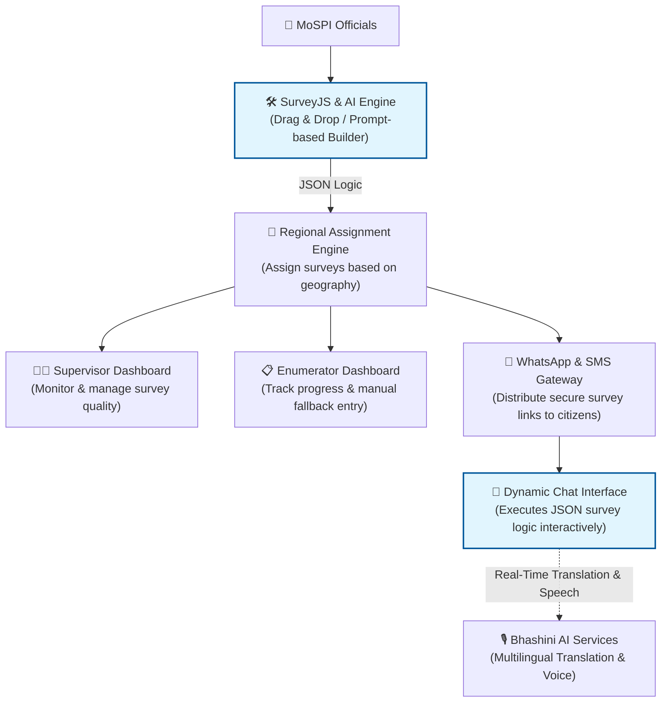

# 🇮🇳 MOSPI Survey System (Statathon 26)

[](https://www.java.com/)
[](https://spring.io/projects/spring-boot)
[](https://www.python.org/)
[](https://fastapi.tiangolo.com/)
[](https://react.dev/)
[](https://ai.google.dev/gemma)
[](https://bhashini.gov.in/)
[](https://www.postgresql.org/)
[](https://mospi.gov.in/)

> A next-generation, AI-driven enterprise survey platform designed to completely revolutionize the survey lifecycle for the **Ministry of Statistics and Programme Implementation (MoSPI)**.

---

## 📌 Executive Summary

Modern large-scale data collection requires agile, intelligent, and multimodal systems. The **MOSPI Survey System** introduces an AI-assisted survey creation workflow, robust offline-first synchronization, and real-time dashboard analytics. 

By leveraging **Gemma 3:4B** and **Bhashini AI**, we automate the generation of methodologically sound questions, apply semantic gap detection against historical data, and deploy the surveys seamlessly across Web, SMS, and WhatsApp channels in multiple Indian languages.

---

## 📹 Prototype Demo Video

Watch the working prototype demonstration showcasing the AI Survey Builder, Multimodal Deployment, and Real-Time Analytics:

<video src="https://github.com/user-attachments/assets/9e7b3074-d464-4715-b02e-946e1031fd14" controls width="100%"></video>

<br/>

---

## 🏛️ Logical Architecture Flow



---

## 🏛️ Logical Architecture Flow


---

## 📸 Screenshots

### 1. AI Survey Builder Interface
*(Add your screenshot here! Example: ``)*

### 2. Analytics Dashboard Overview
*(Add your screenshot here!)*

### 3. WhatsApp / SMS Deployment
*(Add your screenshot here!)*

---

## ✨ Key System Innovations & Features

### 1. 🤖 AI Survey Builder (SurveyJS + LLM)
- **Smart Generation:** Input a prompt (e.g., "Monthly Per Capita Expenditure on food") and the AI automatically fetches relevant context, detects gaps, and generates standard questions matching MOSPI methodologies.
- **Form Designer (SurveyJS):** No-code interactive drag-and-drop interface for structuring questions, assigning skip logic, and setting validation rules exported directly to JSON.

### 2. 📱 Multimodal Deployment
- **Web App:** A responsive, React-based portal for enumerators and nodal officers.
- **WhatsApp Integration:** Automated citizen outreach and interactive survey completion directly via WhatsApp using a Rule-Based Chat Engine.
- **SMS Gateway:** Automated SMS fallback mechanisms and OTP verifications for maximum reach in rural areas.

### 3. 🗣️ Multilingual Voice & Chat (Bhashini AI)
- Native integration with **Bhashini API** provides seamless translation and speech-based interaction, allowing rural citizens to take the survey in their regional dialect through WhatsApp audio.

### 4. 🏛️ Robust Microservices Architecture
- **API Gateways & Microservices:** Independent services handling AI inference (FastAPI), Core Business Logic (Spring Boot), SMS Routing, and OTP validation.
- **Security First:** Implements Spring Security for role-based access, and TLS + Encrypted Storage to protect sensitive paradata at rest and in transit.

*(Note: The separate `datavalidation` AI anomaly detection platform operates as a distinct repository/module and is tracked independently).*

---

## 🛠️ Technology Stack

| Layer | Technology Used | Description |
| :--- | :--- | :--- |
| **Frontend UI** | **React, Vite, SurveyJS** | Mobile-friendly UI for dashboards, chat interface, and no-code builder |
| **Core Backend** | **Java Spring Boot, Spring Security** | Secure, scalable APIs, workflow logic, and role-based access |
| **Database** | **PostgreSQL** | Structured storage for surveys, responses, paradata, and codes |
| **AI Backend** | **FastAPI, Python 3.10+** | Low-latency REST API for LLM inference |
| **Generative AI** | **Google Gemma (Ollama)** | Semantic gap detection & question generation |
| **Translation/Voice** | **Bhashini AI Services** | Multilingual & speech-based survey interactions |
| **Communications** | **WhatsApp API / SMS Gateway** | Secure survey link distribution and interaction |
| **Security** | **TLS + Encrypted Storage** | Protects sensitive data in transit and at rest |

---

## 📂 Project Repository Structure

```text
mospi-survey-system/
├── apps/
│   └── frontend/          # React + Vite web portal (Dashboard, Builder, Registry)
├── services/
│   ├── ai-engine/         # FastAPI + Python + Gemma LLM for semantic question generation
│   ├── core-backend/      # Spring Boot server for database and main business logic
│   ├── sms-service/       # Spring Boot service for Twilio/WhatsApp integration
│   └── otp-service/       # Auth/OTP handling service
└── docs/                  # Assorted documentation and diagrams
```

---

## 🚀 Quick Start Guide

### Prerequisites
- **Node.js**: `v18` or higher
- **Java**: `17` or higher, with **Maven**
- **Python**: `3.10` or higher
- **Ollama**: Running `gemma3:4b` model
- **PostgreSQL**: Running locally

### Option 1: Unified Startup Script
*(If you create a `start_all.sh` or `.bat`, document its usage here)*

### Option 2: Manual Step-by-Step Launch

#### 1. Start the Frontend
```bash
cd apps/frontend
npm install
npm run dev
```
- **Frontend App**: `http://localhost:5173`

#### 2. Start the AI Engine
```bash
cd services/ai-engine
source .venv/Scripts/activate
uvicorn app.main:app --host 0.0.0.0 --port 8000 --reload
```
- **AI API**: `http://localhost:8000`

#### 3. Start Core & SMS Services
*Ensure your `.env` or `application.properties` (DB credentials, Twilio keys) are configured.*
```bash
cd services/core-backend
./mvnw spring-boot:run

cd ../sms-service
./mvnw spring-boot:run
```

---

## 👥 Team & Acknowledgments

Currently under active development by:

**Team CODE SENTINELS**

- **Yogeswaran V** – *AI Engineer*
- **Sabesh Pranith J** – *AI Engineer*
- **Mohith S** – *Backend Developer*
- **Thithiksaa S K** – *Frontend Developer*

---

## 📄 License
This project was developed for the **MOSPI Survey Innovation Hackathon - STATATHON 2025**. All rights reserved by the respective team members.

---

<p align="center">
  Made with ❤️ by <b>Team CODE SENTINELS</b> for MoSPI and Citizens.
</p>
